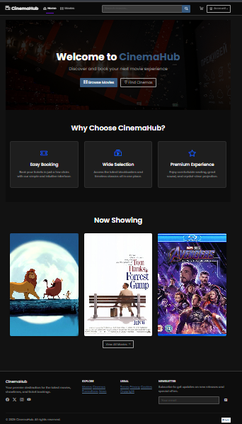
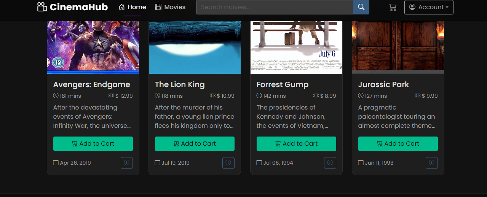
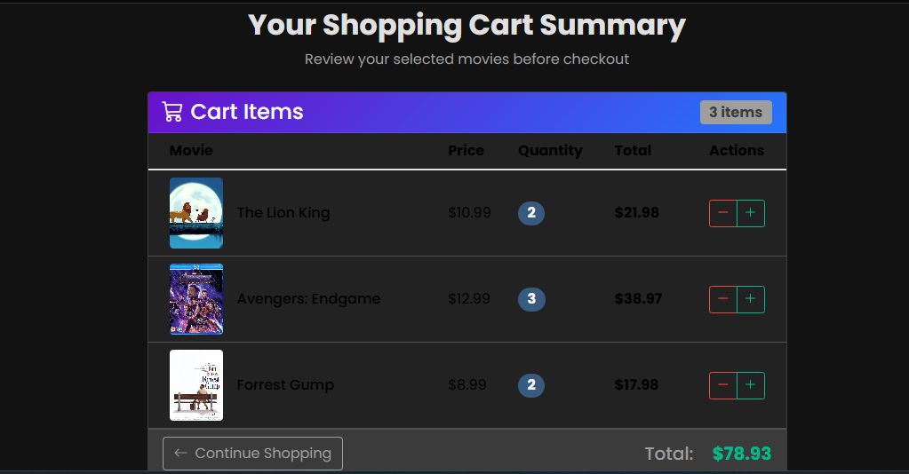

# 🎬 CinemaHub - Modern Movie Theater Management System

 <!-- Add actual screenshot path -->

## 🚀 Overview

CinemaHub is a full-featured ASP.NET Core web application for managing movie theaters, featuring:

- **Customer-facing portal** for browsing movies and booking tickets
- **Admin dashboard** for comprehensive theater management
- **Responsive design** that works on all devices
- **Secure authentication** with role-based access control

## ✨ Key Features

### For Moviegoers
🎟️ Browse movies with trailers, ratings and showtimes  
🔍 Powerful search and filtering  
🛒 Intuitive shopping cart for ticket purchases  
📱 Mobile-friendly interface  

### For Theater Managers
📊 Full CRUD operations for movies, cinemas, and showtimes  
👥 User and role management  
📈 Sales reporting and analytics  
⚙️ System configuration tools  

## 🛠 Tech Stack

**Frontend**  
• Bootstrap 5 (Dark Theme)  
• Bootstrap Icons  
• AOS Animations  
• Responsive CSS  

**Backend**  
• ASP.NET Core MVC  
• Entity Framework Core  
• Identity Framework  

**Database**  
• SQL Server (compatible with other relational DBs)  

## 📦 Installation

1. Clone the repo:
   ```bash
   git clone https://github.com/yourusername/CinemaHub.git
   
2. Configure database in appsettings.json:

"ConnectionStrings": {
  "DefaultConnection": "YourConnectionStringHere"
}

3.Apply migrations:

dotnet ef database update

📂 Project Structure
CinemaHub/
├── Controllers/
├── Data/
├── Models/
├── Services/
├── ViewModels/
├── Views/
├── wwwroot/
└── README.md
📸 Screenshots
<div align="center">
  
  
  
   
</div>


📜 License
Distributed under the MIT License. See LICENSE for more information.


<p align="center"> Made with ❤️ and ASP.NET Core </p> ``